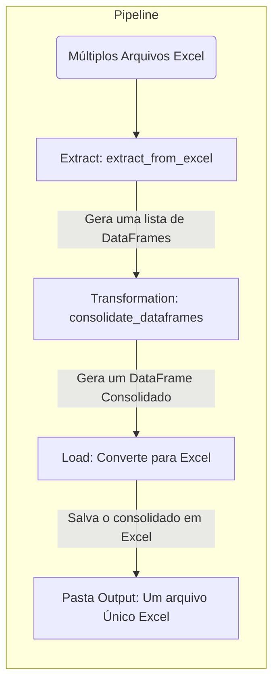

 
# Estrutura Projeto de Dados
Bem-vindo à documentação do pipeline ETL.

## Workflow

```mermaid
flowchart LR
  subgraph ETL[Pipeline]
    A(Múltiplos Arquivos Excel) --> B[Extract: extract_from_excel]
    B[Extract: extract_from_excel] --> |Gera uma lista de DataFrames| C[Transformation: consolidate_dataframes]
    C[Transformation: consolidate_dataframes] --> |Gera um DataFrame Consolidado| D[Load: Converte para Excel]
    D[Load: Converte para Excel] --> |Salva o consolidado em Excel| E[Pasta Output: Um arquivo Único Excel]
  end
```